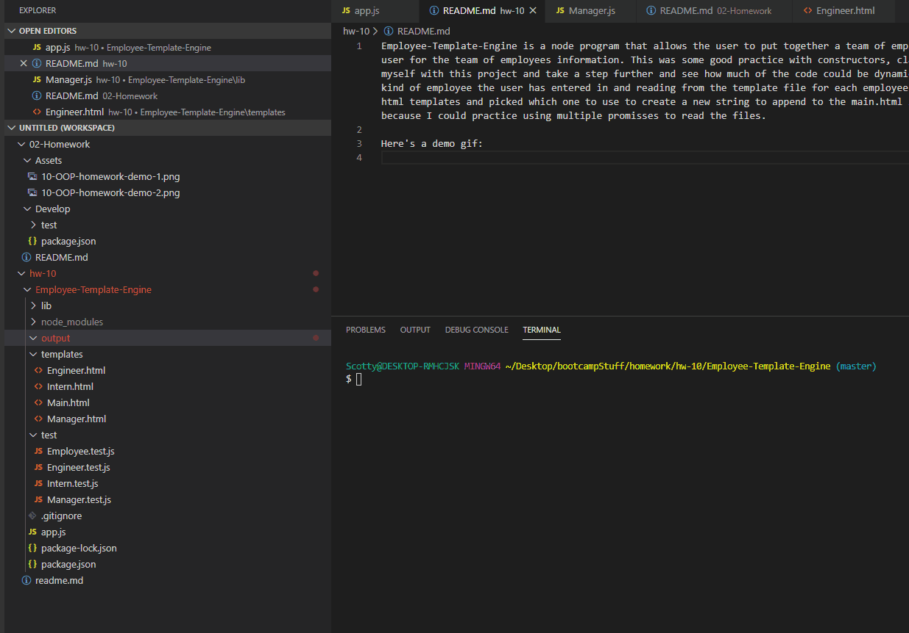

# Employee Team Generator
Employee-Template-Engine is a node program that allows the user to put together a team of employees. It builds a basic looking html page after prompting the user for the team of employees information. This was some good practice with constructors, classes, and inheritance in javascript. I wanted to challenge myself with this project and take a step further and see how much of the code could be dynamically created or run. Rather than resolving dynamically which kind of employee the user has entered in and reading from the template file for each employee I could have just created 3 constant strings for each of the html templates and picked which one to use to create that employees html portion to append to the main html page. But the approach I decided to take was interesting because I could practice using multiple promisses to read the files.

Here's a demo gif:

 ## License
This project is licensed under the MIT License - see the [LICENSE.md](LICENSE.md) file for details